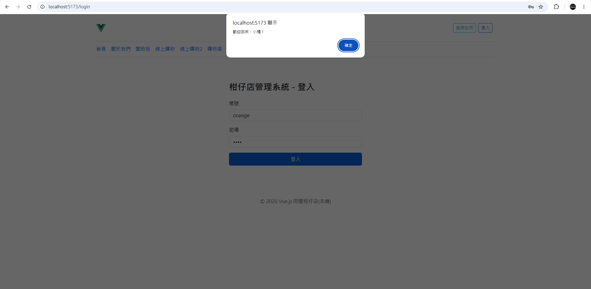
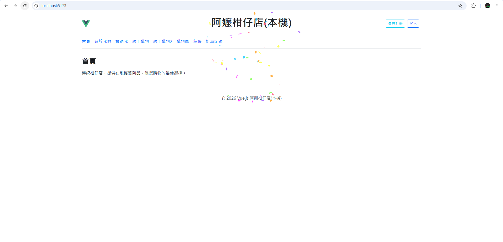
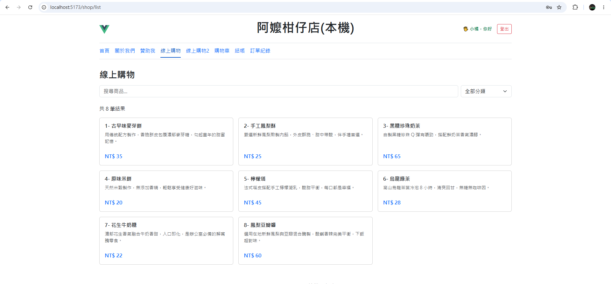
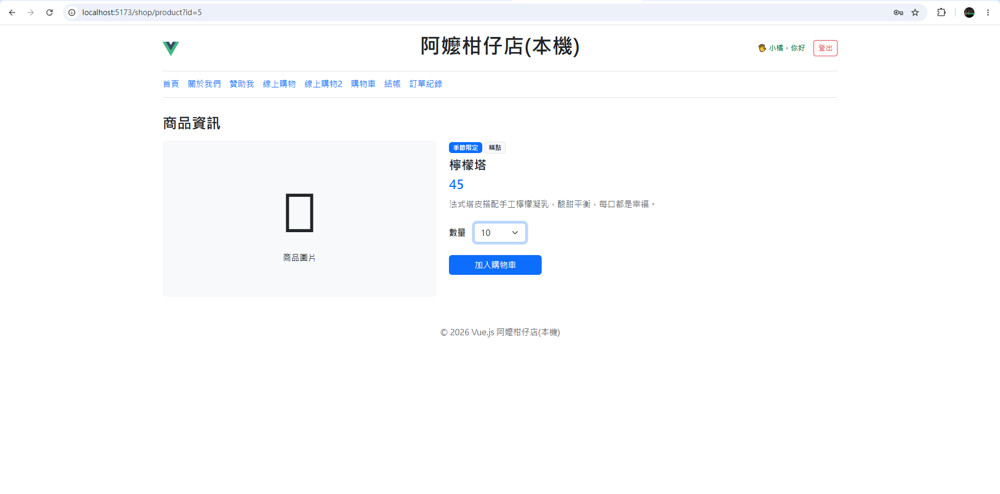
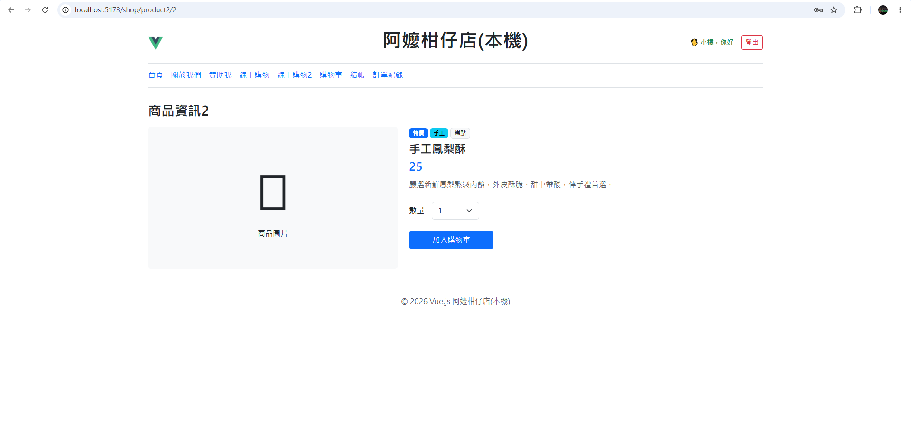
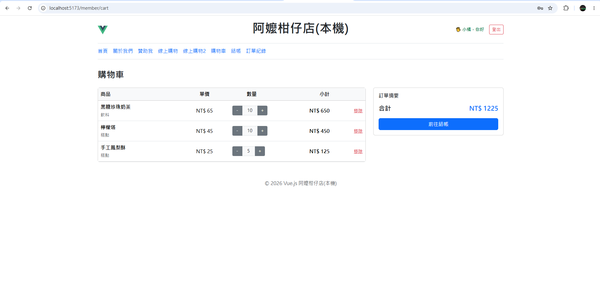
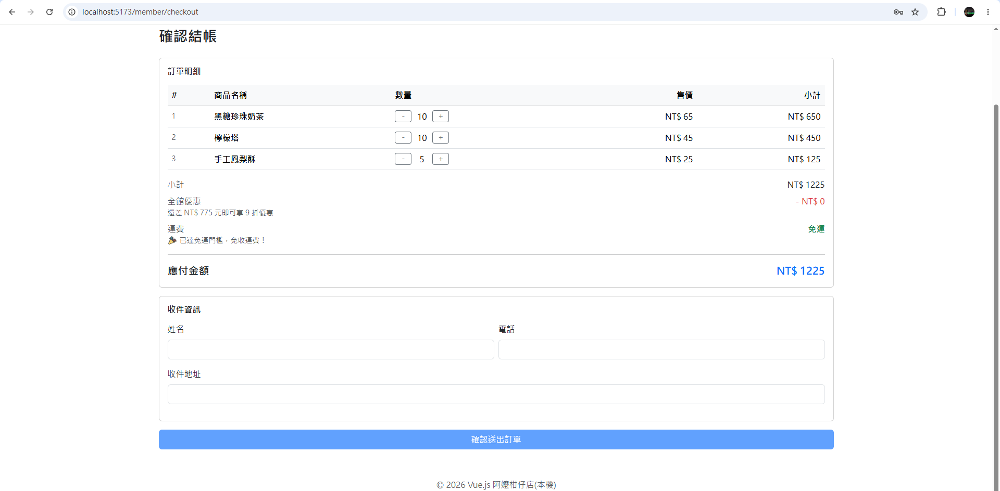
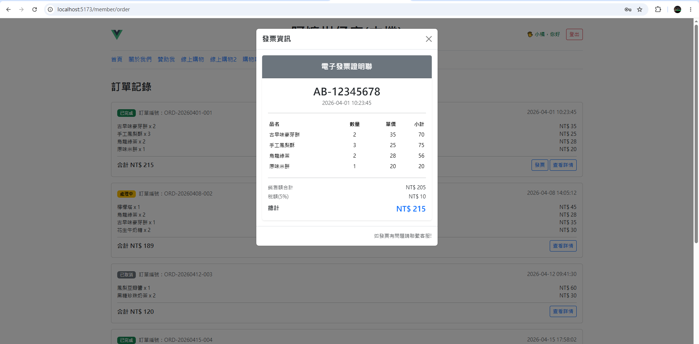
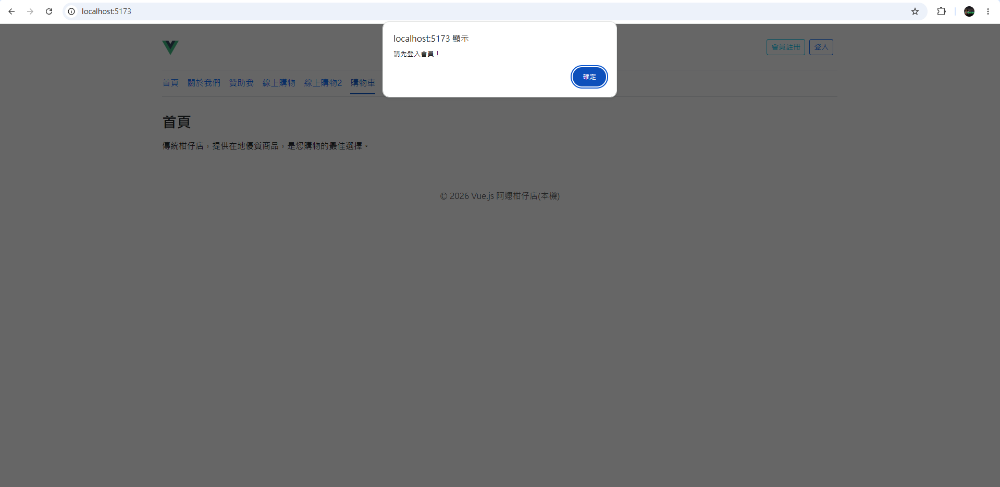
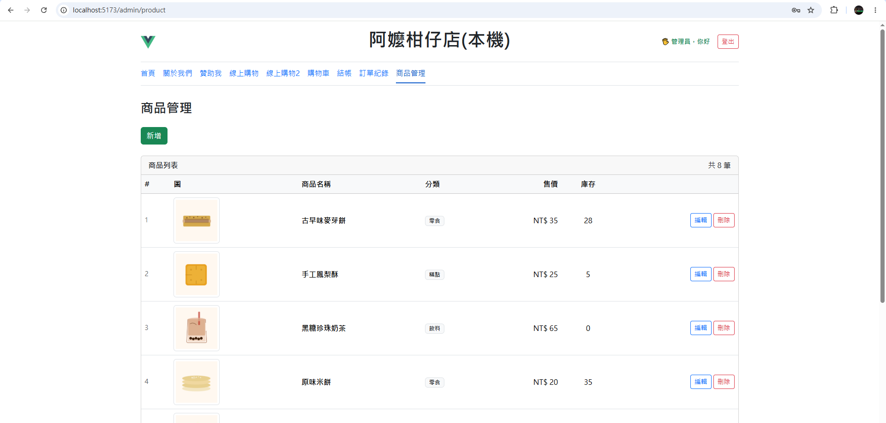

# my-firstVue

This template should help get you started developing with Vue 3 in Vite.

## Recommended IDE Setup

[VS Code](https://code.visualstudio.com/) + [Vue (Official)](https://marketplace.visualstudio.com/items?itemName=Vue.volar) (and disable Vetur).

## Recommended Browser Setup

- Chromium-based browsers (Chrome, Edge, Brave, etc.):
  - [Vue.js devtools](https://chromewebstore.google.com/detail/vuejs-devtools/nhdogjmejiglipccpnnnanhbledajbpd)
  - [Turn on Custom Object Formatter in Chrome DevTools](http://bit.ly/object-formatters)
- Firefox:
  - [Vue.js devtools](https://addons.mozilla.org/en-US/firefox/addon/vue-js-devtools/)
  - [Turn on Custom Object Formatter in Firefox DevTools](https://fxdx.dev/firefox-devtools-custom-object-formatters/)

## Customize configuration

See [Vite Configuration Reference](https://vite.dev/config/).

## Project Setup

```sh
npm install
```

### Compile and Hot-Reload for Development

```sh
npm run dev
```

## 🧭 實機執行畫面
 
### 畫面 1 — 線上購物列表 `/shop/list`
 

 
商品卡片式總覽頁，支援**關鍵字搜尋**與**分類篩選**。路由以 `/shop` 巢狀路由設計，`meta: { requiresMember }` 搭配 `beforeEach` 守衛保護需登入頁面。
 
---
 
### 畫面 2 — 全站導覽列 `App.vue` 線上購物 `/shop/list`
 

 
根元件，包含 Header、`<RouterView />`、Footer。`v-if="authStore.isLoggedIn"` 動態切換登入 / 未登入區塊；`v-if="authStore.isAdmin"` 控制「商品管理」選單是否顯示。頁面載入時執行 `confetti()` 撒花特效。



---
 
### 畫面 3 — 商品資訊（Query String） `/shop/product?id=5`
 

 
以 `?id=N` 傳遞商品 ID，透過 `route.query.id` 取值。商品標籤（季節限定 / 糕點）、售價、數量下拉選單，點擊「加入購物車」寫入 `cartStore`。
 
---
 
### 畫面 4 — 商品資訊2（動態路由） `/shop/product2/2`
 

 
以 `/:productId?` 傳遞商品 ID，透過 `route.params.productId` 取值。與畫面 3 功能相同，示範 Vue Router **兩種路由寫法差異**。後台改用封裝 `api` 實例（`axios.create`）取代硬寫 URL，`save()` 以 `form.id == null` 判斷執行 POST（新增）或 PUT（修改）。
 
---
 
### 畫面 5 — 購物車 `/member/cart`
 

 
`v-if="cartStore.items.length === 0"` 切換空狀態提示。數量調整呼叫 `cartStore.reduceItem()`，小計 `price × quantity` 即時計算；`cartStore.removeItem()` 移除單項；右側顯示 `cartStore.total` 合計。
 
---
 
### 畫面 6 — 確認結帳 `/member/checkout`
 

 
`watch(() => cartStore.total, ..., { immediate: true })` 監聽金額變化，動態計算**運費**（滿 1000 免運）與**折扣**（滿 2000 享 9 折）。`watchEffect` 自動追蹤應付金額；收件資訊三欄位全填後 `:disabled="!done"` 才啟用送出按鈕。
 
---
 
### 畫面 7 — 訂單記錄與電子發票 `/member/order`
 

 
子元件 `OrderDetail` 透過 `defineProps` 接收訂單資料，`defineEmits` 向上傳遞事件。狀態標籤以 `:class` 動態配色（已完成綠 / 處理中黃 / 已取消灰）；`v-if="orderInvoice != null"` 控制發票按鈕顯示。電子發票 Modal 以含稅金額反推稅前額：`Math.round(total / 1.05)`。
 
---
 
### 畫面 8 — 商品管理後台 `/admin/product`
 

 
限管理員進入（`meta: { requiresAdmin }`）。`api.js` 以 `axios.create` 封裝 `baseURL`（讀取 `.env`）與 30 秒 timeout；**請求攔截器**自動夾帶 `Bearer Token`；**回應攔截器**統一處理 401（強制登出）、403（權限不足）、500（伺服器錯誤）。
 
---
 
### 畫面 9 — 未登入存取保護 `/`
 

 
點擊需登入頁面時，`router.beforeEach` 守衛檢查 `to.meta.requiresMember && !authStore.isLoggedIn`，彈出 alert 並 `return { name: 'login' }` 中止導航。管理員頁面同理檢查 `requiresAdmin && !authStore.isAdmin`，踢回首頁。
 
---
